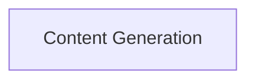
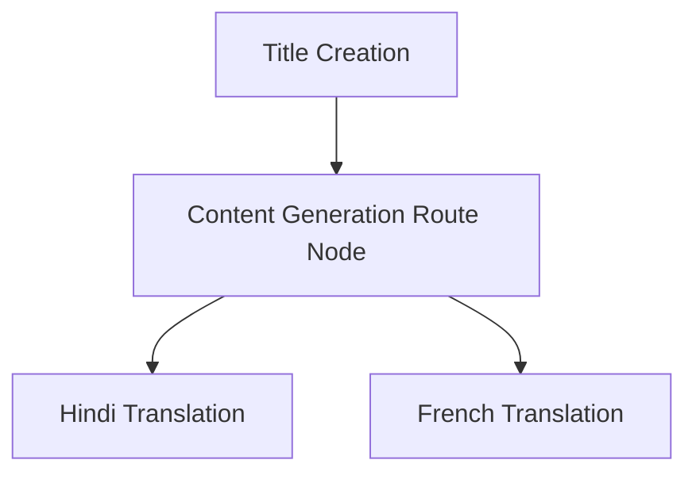

AGENTIC BLOG GENERATER
======================
This project is a compact, friendly example of agentic AI in action. You give it
a topic, it builds a complete blog post (title + content). If you add a
language, the graph routes the output through translation nodes (Hindi or
French). The goal is to be easy to read, easy to run, and easy to extend.

Why this is worth exploring
---------------------------
- The graph is explicit: you can see every step of the workflow.
- The code is modular: state, nodes, graph builder, and LLM are separated.
- The API is simple: one POST request gives you a full blog.
- It is designed to hack on: add new nodes or languages quickly.

What it does
------------
- Generates a blog title and long-form content from a topic.
- Routes content through translation nodes when a language is provided.
- Exposes the pipeline via a FastAPI endpoint.
- Documents the graphs with Mermaid diagrams.

How it works (quick view)
-------------------------
Topic -> Title Creation -> Content Generation -> Route -> Translation (optional)

```text
                +-------------------+
                |  Title Creation   |
                +-------------------+
                          |
                          v
                +-------------------+
                | Content Generator |
                +-------------------+
                          |
                          v
                +-------------------+
                |    Route Node     |
                +-------------------+
                       /     \
                      v       v
           +----------------+  +----------------+
           | Hindi Translate|  | French Translate|
           +----------------+  +----------------+
```

Graphical representation
------------------------
Simple agent graph (Content Generation):



Full routing graph (Title + Route + Translations):



Graph files live in `Graphical Representation/`:
- `Graphical Representation/content-generation-graph.md`
- `Graphical Representation/translation-routing-graph.md`

Quickstart
----------
1) Create a `.env` file (see Environment variables).
2) Install dependencies.
3) Run the API.

```powershell
python -m venv .venv
.\.venv\Scripts\activate
pip install -r requirements.txt
uvicorn app:app --reload
```

Environment variables
---------------------
Create `.env` with the following keys:

```bash
GROQ_API_KEY=your_groq_key
LANGCHAIN_API_KEY=your_langsmith_key
```

Try it
------
POST `/blogs` with JSON payload:

```json
{ "topic": "Agentic AI" }
```

Optional translation:

```json
{ "topic": "Agentic AI", "language": "french" }
```

Example curl:

```bash
curl -X POST http://localhost:8000/blogs ^
  -H "Content-Type: application/json" ^
  -d "{\"topic\":\"Agentic AI\",\"language\":\"french\"}"
```

Project structure
-----------------
```text
.
+-- Graphical Representation
¦   +-- content-generation-graph.md
¦   +-- translation-routing-graph.md
+-- app.py
+-- langgraph.json
+-- main.py
+-- pyproject.toml
+-- README.md
+-- request.json
+-- requirements.txt
+-- uv.lock
+-- src
    +-- __init__.py
    +-- graphs
    ¦   +-- __init__.py
    ¦   +-- graph_builder.py
    +-- llms
    ¦   +-- __init__.py
    ¦   +-- groqllm.py
    +-- nodes
    ¦   +-- __init__.py
    ¦   +-- blog_node.py
    +-- states
        +-- __init__.py
        +-- blogstare.py
```

Key files (start here)
----------------------
- `app.py`: FastAPI app and `/blogs` endpoint orchestration.
- `src/graphs/graph_builder.py`: LangGraph assembly and conditional routing.
- `src/nodes/blog_node.py`: LLM prompts for title, content, and translation.
- `src/llms/groqllm.py`: Groq LLM initialization via LangChain.
- `src/states/blogstare.py`: Typed state schema for the graph.
- `langgraph.json`: LangGraph API discovery entry.
- `request.json`: Sample requests for quick testing.

Tools and technologies
----------------------
- Python 3.12
- FastAPI + Uvicorn
- LangChain + LangGraph
- Groq (Llama 3.1 8B Instant)
- Pydantic
- python-dotenv
- LangGraph CLI (in-memory)

Notes
-----
- Language routing currently supports Hindi and French; add more routes in
  `src/nodes/blog_node.py` and `src/graphs/graph_builder.py`.
- `main.py` is a simple entry stub and does not run the API.